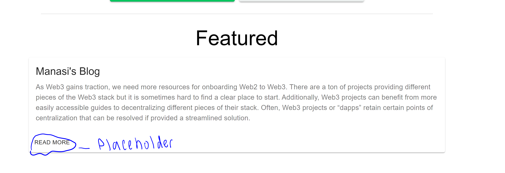
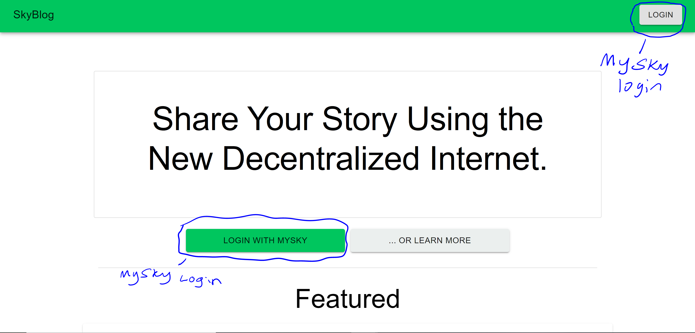
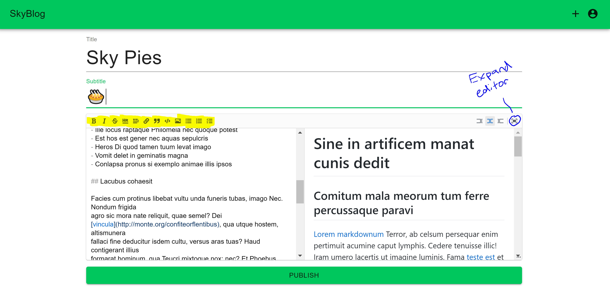

# How to Navigate the Skyblog UI
The SkyBlog is a Skynet web app for blogging in markdown. Your posts are tied to your MySky account
## Featured Section

If you scroll down on the homepage, we have a featured section. This is where you'll be able to read the posts of other SkyBlog users. The current UI is just a placeholder of what the feature will look like

## Logging In

You can click on the Login button at the top right, or the green button that says "LOGIN WITH MYSKY". Either one will open a MySky popup allowing you to login with your current MySky account or generate a new seed. 

## Logged In View

After you've logged in, the UI will change to show you some new options. You can create your first blog post, or you can view your profile

## Creating a Post

You can write your post in Markdown, or you can use the toolbar icons if you prefer. I've highlighted the toolbar in yellow. The default editor is a bit small, so you may prefer to write it in full screen mode. 

When you're done writing, you can click the green "Publish" button. This will save your post and make it available for the whole world to see.
## Your Profile
... To be  determined